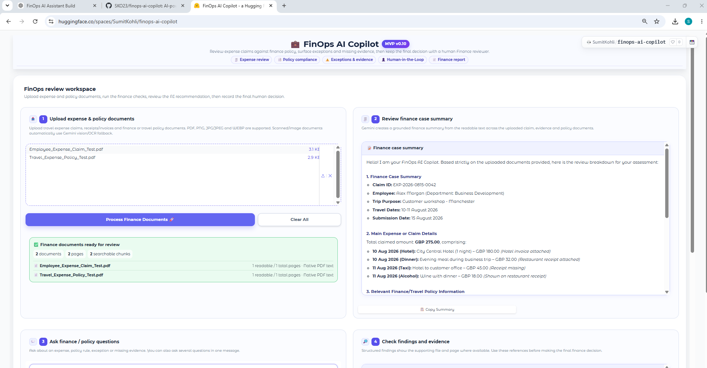
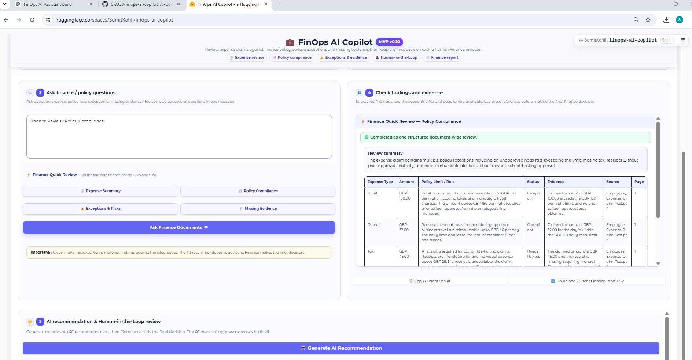
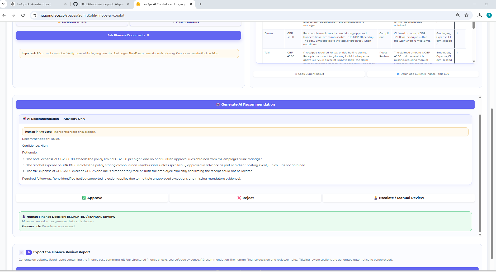

# 💼 FinOps AI Copilot

**AI-powered expense review, policy compliance and Human-in-the-Loop finance decisions.**

[🚀 **Live Demo on Hugging Face**](https://huggingface.co/spaces/SumitKohli/finops-ai-copilot)

FinOps AI Copilot is an MVP that helps Finance teams review employee expense claims against travel and expense policies, identify exceptions and missing evidence, generate an advisory AI recommendation, and retain the **final decision with a human Finance reviewer**.

---

## 🖥️ Demo



---

## 🎯 The Problem

Finance teams often need to manually compare:

* Expense claims
* Receipts and invoices
* Travel & expense policies
* Approval evidence
* Policy limits and exceptions

This creates repetitive review work and can make it difficult to consistently identify missing evidence, policy breaches and cases requiring manual escalation.

---

## 💡 The Solution

FinOps AI Copilot combines document extraction, semantic retrieval and Generative AI to support a structured finance review workflow:

**Upload → Extract → Retrieve Evidence → Check Policy → Identify Exceptions → AI Recommendation → Human Decision → Finance Report**

The AI supports the reviewer but does **not** make the final financial decision.

---

## ✨ Core Features

### 📤 1. Expense & Policy Document Upload

Supports finance and travel documents including:

* PDF expense claims
* Travel & expense policies
* Receipts
* Invoices
* JPG / JPEG
* PNG
* WEBP

Multiple documents can be analysed together.

---

### 🧾 2. Finance Case Summary

The Copilot extracts and summarises relevant information such as:

* Employee / claimant
* Expense type
* Date
* Amount
* Currency
* Merchant / provider
* Travel purpose
* Supporting evidence
* Relevant policy information

---

### 🔎 3. Finance / Policy Q&A

Users can ask questions directly against the uploaded documents, for example:

> Is the hotel expense within policy?

> Which expenses require manual review?

> What supporting evidence is missing?

> Why is this claim being escalated?

Answers are grounded in retrieved document evidence and include **source file and page references where available**.

---

### ⚡ 4. Structured Finance Quick Reviews

The application provides four one-click finance checks.

#### 🧾 Expense Summary

Extracts structured expense information including:

* Expense type
* Date
* Amount
* Currency
* Merchant / provider
* Claimant
* Source
* Page

#### 📑 Policy Compliance

Compares expenses against uploaded finance or travel policies and identifies:

* Compliant expenses
* Policy exceptions
* Policy limits
* Items requiring manual review
* Relevant evidence



#### ⚠️ Exceptions & Risks

Identifies issues such as:

* Expenses above policy limits
* Non-reimbursable expenses
* Missing approvals
* Policy exceptions
* Potential review risks

#### 📎 Missing Evidence

Identifies missing documentation such as:

* Receipts
* Invoices
* Manager approvals
* Proof of payment
* Required supporting evidence

---

## 👁️ Multimodal Receipt / OCR Support

The application uses a two-stage document extraction approach.

### Native PDF Text

For text-based PDFs, the application first uses standard PDF text extraction.

This is fast and preserves document/page information.

### Gemini Vision / OCR Fallback

If readable text cannot be extracted normally, the application can use **Google Gemini multimodal document understanding** to read scanned or image-based content.

This enables the MVP to process:

* Scanned PDFs
* Photographed receipts
* JPG / JPEG receipts
* PNG images
* WEBP images

The extracted text then enters the same finance review workflow.

---

## 🧠 Document Grounding & Retrieval

The application uses a RAG-style retrieval workflow to ground AI responses in uploaded documents.

The process includes:

1. Document text extraction
2. Page-level metadata preservation
3. Text chunking
4. Sentence Transformer embeddings
5. Semantic retrieval
6. Keyword / evidence matching
7. Gemini analysis
8. Source and page references

This helps reduce unsupported answers and allows Finance reviewers to trace findings back to uploaded evidence.

---

## 🤖 AI Recommendation

The Copilot generates an **advisory AI recommendation** based on the available evidence.

Possible recommendations include:

* ✅ APPROVE
* ❌ REJECT
* 👤 ESCALATE / MANUAL REVIEW

The recommendation includes:

* Confidence level
* Rationale
* Identified exceptions
* Required follow-up

---

## 🤝 Human-in-the-Loop Governance

The AI recommendation is deliberately separated from the final Finance decision.

The authorised reviewer can independently select:

* ✅ **Approve**
* ❌ **Reject**
* 👤 **Escalate / Manual Review**

The reviewer can also record a decision note.



This demonstrates a **Human-in-the-Loop governance model** in which:

> **AI recommends. Human decides.**

---

## 📄 Finance Review Report

The application generates an editable Word report containing:

* Finance case summary
* Documents reviewed
* Expense Summary
* Policy Compliance
* Exceptions & Risks
* Missing Evidence
* Source/page references
* AI recommendation
* Human Finance decision
* Reviewer notes
* AI governance notice

This creates a clear separation between the AI-generated analysis and the authorised human decision.

---

## 🏗️ High-Level Architecture

```text
                   ┌─────────────────────────┐
                   │ Expense / Policy Files  │
                   │ PDF / JPG / PNG / WEBP │
                   └────────────┬────────────┘
                                │
                   ┌────────────▼────────────┐
                   │ Document Extraction     │
                   │                         │
                   │ Native PDF text first   │
                   │ Gemini Vision fallback  │
                   └────────────┬────────────┘
                                │
                   ┌────────────▼────────────┐
                   │ Chunking + Embeddings   │
                   │ all-MiniLM-L6-v2        │
                   └────────────┬────────────┘
                                │
                   ┌────────────▼────────────┐
                   │ Evidence Retrieval      │
                   │ Semantic + Keyword      │
                   └────────────┬────────────┘
                                │
                   ┌────────────▼────────────┐
                   │ Gemini Finance Analysis │
                   └────────────┬────────────┘
                                │
            ┌───────────────────┼───────────────────┐
            │                   │                   │
            ▼                   ▼                   ▼
     Policy Compliance   Exceptions & Risks   Missing Evidence
            │                   │                   │
            └───────────────────┼───────────────────┘
                                │
                   ┌────────────▼────────────┐
                   │ AI Recommendation       │
                   │ Advisory Only           │
                   └────────────┬────────────┘
                                │
                   ┌────────────▼────────────┐
                   │ Human Finance Decision  │
                   └────────────┬────────────┘
                                │
                   ┌────────────▼────────────┐
                   │ Finance Review Report   │
                   └─────────────────────────┘
```

---

## 🛠️ Technology Stack

* **Python**
* **Gradio**
* **Google Gemini API**
* **Sentence Transformers**
* **all-MiniLM-L6-v2 embeddings**
* **PyPDF**
* **python-docx**
* **NumPy**
* **Docker**
* **Hugging Face Spaces**
* **GitHub**

---

## 📂 Repository Structure

```text
finops-ai-copilot/
│
├── app.py
├── Dockerfile
├── requirements.txt
├── README.md
├── .gitignore
│
├── sample_data/
│   ├── Employee_Expense_Claim_Test.pdf
│   ├── Travel_Expense_Policy_Test.pdf
│   └── FinOps_Test_Taxi_Receipt.jpg
│
└── docs/
    └── screenshots/
        ├── 01-main-interface.png
        ├── 02-policy-compliance.png
        └── 03-hitl-decision.png
```

---

## 🧪 Sample Test Scenario

Synthetic sample data is included in [`sample_data`](sample_data/).

The test scenario contains:

| Expense |  Amount | Policy / Evidence Issue                 |
| ------- | ------: | --------------------------------------- |
| Hotel   | GBP 180 | GBP 150 nightly limit exceeded          |
| Dinner  |  GBP 32 | Within GBP 40 daily meal limit          |
| Taxi    |  GBP 45 | Mandatory receipt missing               |
| Alcohol |  GBP 18 | Non-reimbursable without prior approval |

The application correctly identifies compliant and non-compliant items, missing evidence and cases requiring Finance intervention.

A separate synthetic taxi receipt image is included to test the **Gemini Vision / OCR workflow**.

---

## 🔐 Security

The Gemini API key is stored as an environment secret and is **not committed to the repository**.

For the Hugging Face deployment, the API key is configured using **Space Secrets**.

---

## ⚠️ MVP Limitations

This project is currently an MVP / demonstration application.

It does not currently include:

* User authentication
* Persistent database storage
* ERP integration
* SAP / Oracle / Workday integration
* Corporate card reconciliation
* Enterprise workflow routing
* Role-based access control
* Production audit logging

AI-generated analysis may contain errors and material findings should always be checked against the cited source documents.

**The AI recommendation is advisory only. A human Finance reviewer retains the final decision.**

---

## 🚀 Future Roadmap

Potential enhancements include:

* Expense-management platform integration
* SAP / Oracle / Workday connectors
* Automated expense ingestion
* Corporate-card reconciliation
* Duplicate expense detection
* Fraud / anomaly detection
* Organisation-specific policy libraries
* Persistent case management
* Approval workflows
* Role-based access control
* Audit logs
* Finance dashboards
* Enterprise monitoring and governance

---

## 🌐 Live Application

### [🚀 Launch FinOps AI Copilot on Hugging Face](https://huggingface.co/spaces/SumitKohli/finops-ai-copilot)

---

## 👤 Project

Built as a hands-on AI MVP demonstrating:

**Document AI · Multimodal OCR · Semantic Retrieval · Generative AI · Finance Policy Reasoning · Human-in-the-Loop Governance**

---

*All sample expense and policy documents included in this repository are synthetic and created solely for demonstration and testing.*
